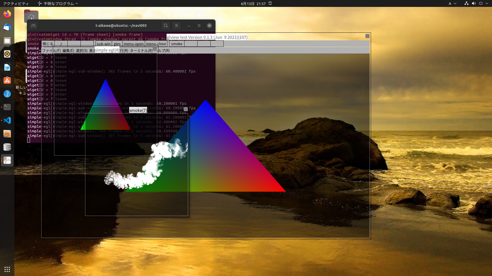
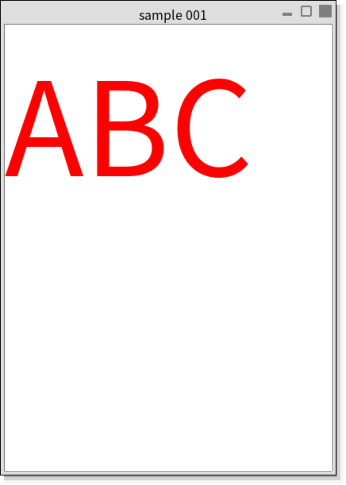
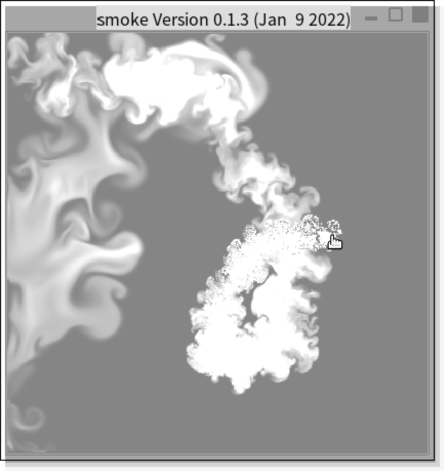
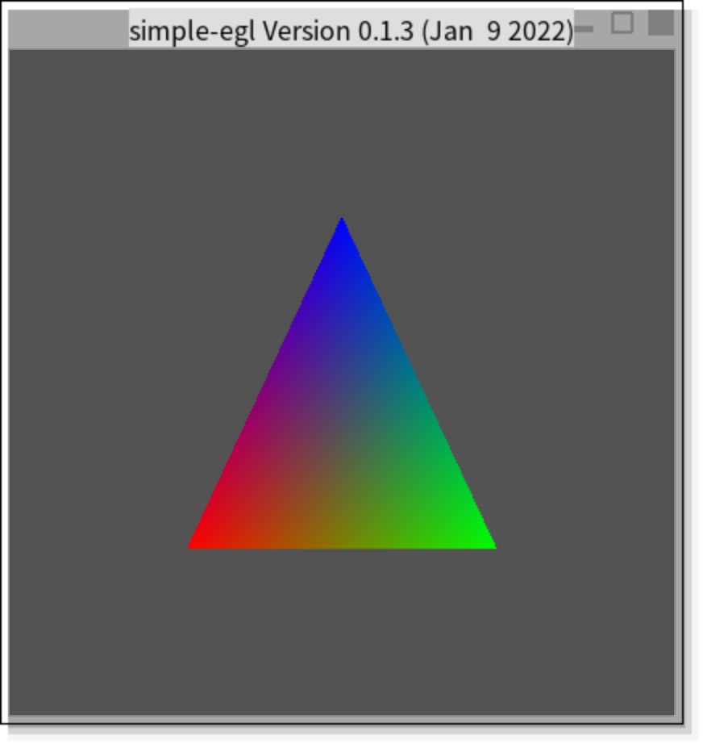
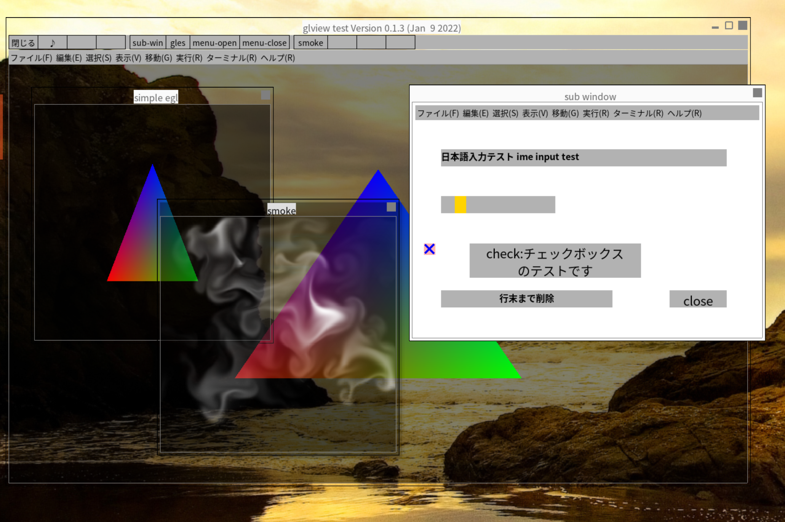
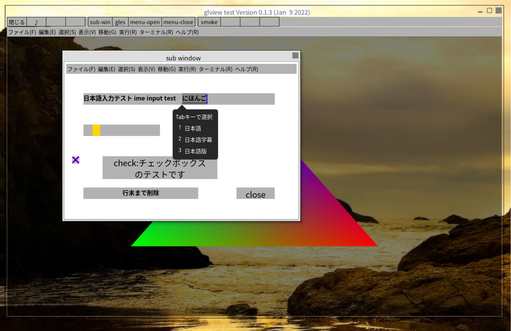
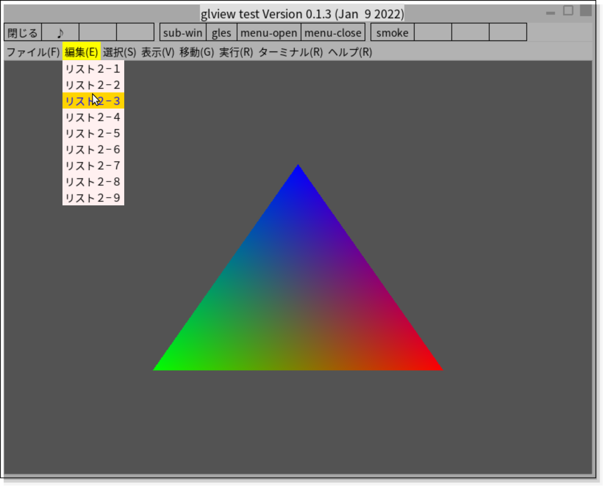

# glview

 ## Opengl-based GUI toolkit for the Wayland display system.

wayland を使用するGUIアプリの開発では、ウインドウズやX11ベースのウインドウシステムが行っている処理をほとんど自分で実装する必要があります。

gui toolkitアプリを作ってみました。



## 開発方針

- 描画は、全てopenglで実装

- アプリケーションからwaylandのAPIを隠蔽

- 文字描画は、freetype2、日本語入力はibus-1.0を使用

- アプリケーション内の各ウインドウは、マルチスレッドで動作。　描画処理や入力イベント処理をマルチスレッドで独立して記述及び動作させることができます。

## 開発環境

- OS ：ubuntu 21.04,21.10、ビルドシステム：meson

## Special Thanks

- 日本語入力は、Araki Kenさんのmltermの https://github.com/arakiken/mlterm/blob/master/inputmethod/ibus/im_ibus.c 及び https://github.com/arakiken/mlterm/blob/master/inputmethod/fcitx/im_fcitx.c を基に作成しました。


- waylandの処理は、https://github.com/wayland-project/weston/blob/main/clients/window.c 及びwindow.hの一部の処理を利用しています。

- aznoteさんの「Wayland プログラミング」 https://aznote.jakou.com/prog/wayland/index.html も参考にさせていただきました。

## 問い合わせ等は、以下のメールアドレスまで

```
aikawat@jcom.home.ne.jp
```

## その他

- fcitx対応は、期待した動作となっていません。

## ビルド手順

```bash
sudo apt install gcc
sudo apt install g++
sudo apt-get install libglib2.0*
sudo apt-get install libway*
sudo apt-get install wayland-protocols
sudo apt-get install libegl1-mesa libegl1-mesa-dev
sudo apt-get install libgles2-mesa-dev
sudo apt-get install libfreetype6-dev
sudo apt-get install libxkbcommon-dev
sudo apt-get install ibus-1.0
sudo apt-get install fcitx-libs-dev
sudo apt-get install libpng-dev
sudo apt-get install fonts-ipa*

sudo apt-get install ninja-build
sudo apt-get install meson

git clone https://github.com/t-aikawa/glview.git
cd glview
./m
---------------------------------------------------------------------
./s001
./s002
./smoke
./simple-egl
./test 
```

## サンプルアプリ(スクリーンショット)

### s001


### smoke


### simple-egl


### test
１つのアプリでウインドウ毎に同時実行が可能


日本語入力


プルダウンメニュー

